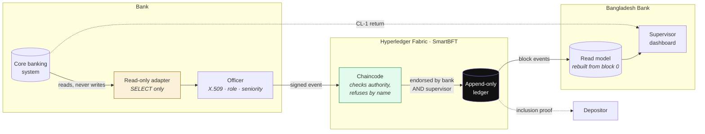
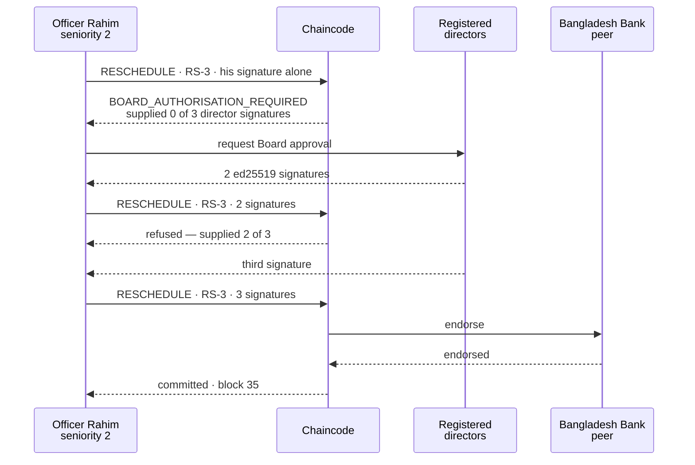
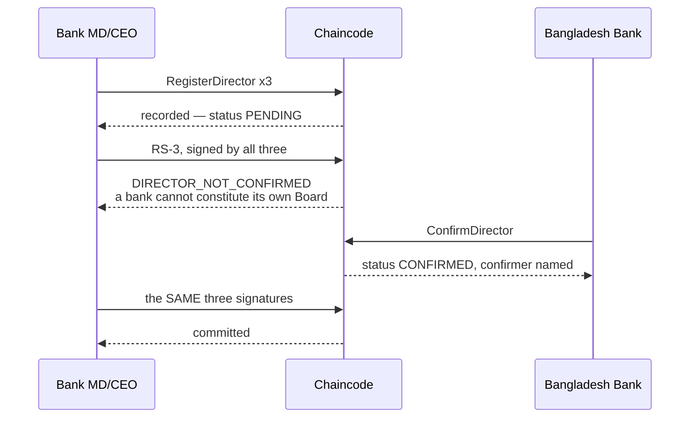
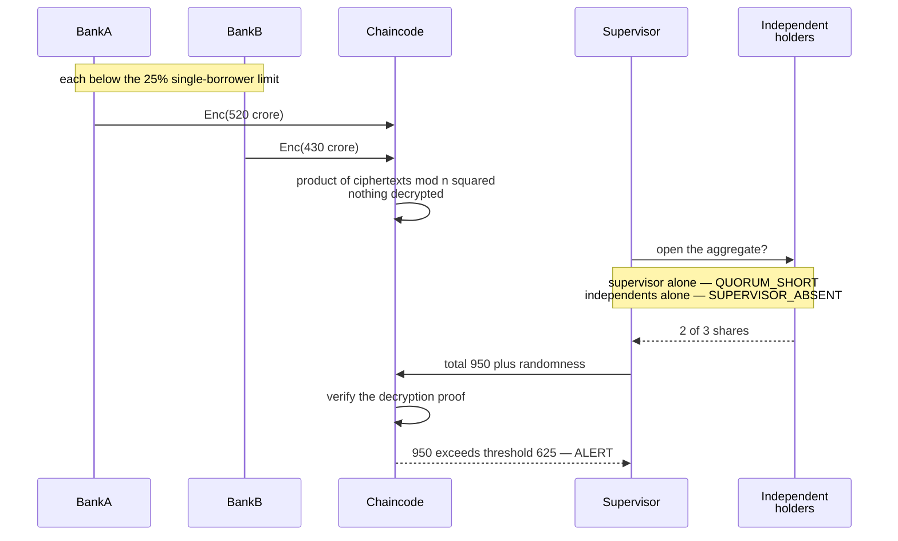
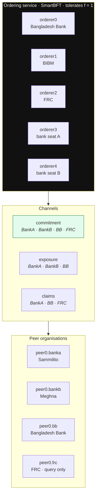
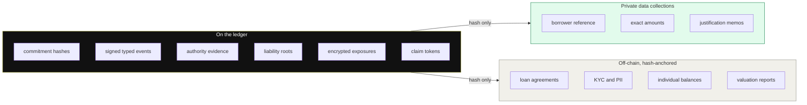
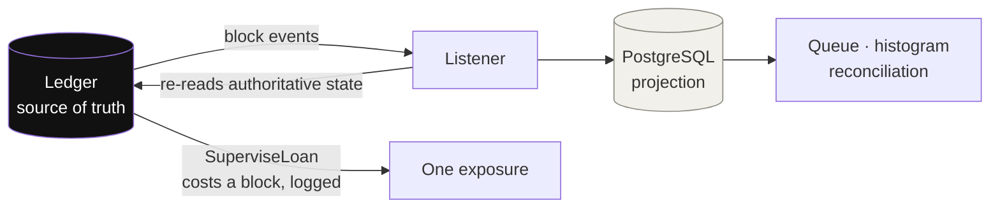

# VERITY

**Making loan classification tamper-evident in Bangladesh's banking system.**
Prototype · BCOLBD 2026, Blockchain Category (Student) · Team Logarithm

> **Status: functionally complete and running.** Fabric v3 BFT network, all four modules driven end to end
> against a real ledger, 8/8 red-team attacks refused, 162 unit tests green. Remaining work is demo assets
> and rehearsal — see [What is built, and what is not](#what-is-built-and-what-is-not).

---

## The problem in one paragraph

Bangladesh's gross non-performing loan ratio stood at **32.26% in March 2026**. An Asset Quality Review of six
banks by Ernst & Young and KPMG assessed **Tk 147,595 crore** of non-performing loans against **Tk 35,044
crore** reported — about 4.2 times. Bangladesh Bank's rules are not what is missing: every classification must
already be justified in writing over two named signatures, rescheduling is capped at three occasions, and the
third attempt needs Board approval. **The record is what is missing.** It is held by the institution being
examined, it can be revised afterwards, and it is read only when an inspector is physically present.

Verity commits those existing signatures to an append-only ledger, checks the approval authority in code
rather than trusting a self-reported field, and measures rescheduling against the statutory quarterly calendar.

---

## What it actually does



The adapter is read-only **at the database grant**, not by convention. Existing CL-1 submission, EDW upload
and CIB reporting continue unchanged — nothing a bank already files is replaced.

---

## Run it

Requires **Docker**, **Node 20+**, and **WSL2** on Windows. First run takes 15–30 minutes, almost all of it
downloading Fabric images.

```bash
git clone https://github.com/ripWr3ncH/Verity-TeamLogarithm
cd Verity-TeamLogarithm

source network/scripts/wsl-env.sh   # WSL2 only: Node + jq into user space, no sudo
cd network && ./bootstrap.sh        # once per machine
cd .. && ./scripts/up.sh            # network, CAs, identities, chaincode, services
```

Then populate it — the order matters, each step depends on the one before:

```bash
node scripts/register-directors.mjs       # k-of-n Board for both banks
npm --prefix seed run generate            # deterministic synthetic portfolio
node scripts/seed-ledger.mjs              # 806 loans onto the ledger  (~60s)
node scripts/seed-cbs.mjs                 # the bank's estate + a CL-1 with omissions
node scripts/run-exposure-ceremony.mjs    # Module II end to end
node scripts/run-liability-commitment.mjs # Modules III and IV end to end
```

Open <http://localhost:3000>. Stop with `./scripts/down.sh`.

---

## The five demonstrations

### Act 1 — an approval level that exists only on paper



The "2 of 3" step is the one that matters — those are real ed25519 signatures, verified against the registered
director set and counted as *distinct* signers. The threshold is not an array-length check.

#### Act 1b — and who decides who the three directors are?

Counting signatures proves that three keys signed. It says nothing about **whose** keys they are. A bank that
can register its own directors registers three, signs its own RS-3 three times, and every check passes except
the one that mattered.



Every signature in the refused attempt is cryptographically valid and every key is in the bank's registered
set. Only the supervisor's confirmation is missing, and that is what made the Board a board.

This adds **no new rule** either: a bank director's appointment already requires Bangladesh Bank's prior
approval under the Bank Company Act 1991. Verity turns an approval that exists on paper into a precondition
the code checks — the same move it makes for BRPD 16/2022 above.

Records written before this control existed carry no status and are treated as **pending**, not
grandfathered in. Failing closed is the only safe direction: the alternative silently exempts exactly the
directors the control exists to catch.

### Act 2 — what the return records, and what the ledger records

The same exposure, two columns. Every quarterly return in the sequence reports it as *Unclassified*.

| CL-1 reference date | Reported | Ledger | E |
|---|---|---|---|
| 30 Jun Y1 | Unclassified | `RESCHEDULE` RS-1, **12 days** before | 0.698 |
| 31 Dec Y1 | Unclassified | `RESCHEDULE` RS-2, **11 days** before | 2.136 |
| 30 Sep Y2 | Unclassified | `RESCHEDULE` RS-3, **15 days** before, Board k-of-n | 4.048 |
| 31 Mar Y3 | Unclassified | `RESCHEDULE` RS-4, **23 days** before | **6.055** |

An ordinary forbearance control over the same period reaches **0.534** — an **11.3× separation** the return
does not carry. Both figures reproduce on the live ledger.

And the honest half: **35% of all reschedulings in this population fall within 30 days of a reference date.**
Ordinary forbearance clusters near period-end too. That is why E\* is calibrated against the measured
distribution rather than against zero, and the histogram sits on the dashboard beside the queue.

### Act 3a — privacy, enforced by the platform

Same query, two identities:

| Caller | `authorised` | Payload | Hash |
|---|---|---|---|
| `BangladeshBankMSP` | true | borrower reference, exact amount, justification | `61311e69…` |
| `BankBMSP` | false | — | `61311e69…` |

Both see the same hash. The payload was never disseminated to BankB's peer — Fabric's private data
collections stop it at the gossip layer, so the chaincode could not reveal it if it wanted to.

### Act 3b — cross-bank exposure without disclosure



Neither bank breaches its own limit. The group breaches the system's. **Paillier adds; it does not compare** —
so the total is threshold-decrypted to the supervisor and compared in the clear, and the chaincode verifies
the announced total against the ciphertext it holds before believing it.

### Act 5 — governance that executes

A bank proposes raising its own alert threshold and is refused at **1 of 3**. Bangladesh Bank approves — **2 of
3**, still refused. The FRC approves and it activates, recorded with named approvers.

Then `./network.sh kill-orderer 3` and the network commits anyway, in 423 ms.

---

## Architecture

### Why Fabric, and why BFT

**Permissioned**, because positions must not be publicly readable and anonymous validators cannot be
accountable under the Bank Companies Act. **Not Corda**, because point-to-point suits bilateral contracts.
**Not Raft** — Raft is crash fault tolerant, it assumes nodes fail rather than lie, and our threat model
explicitly includes collusion among consortium members.



Five ordering nodes, so `n ≥ 3f+1` tolerates **f = 1**. Bangladesh Bank holds endorsement and querying rights
on every channel **from genesis** and cannot be voted out. But endorsement and ordering are separate powers:
it can refuse an event, and it cannot author a bank's record, rewrite a committed one, or decrypt an aggregate
alone — and its own queries are logged.

### On-chain and off-chain



Borrower-group tokens are held as **attestations, never as record keys**, so no ledger query returns a
borrower's identity.

### The read model is a cache



Peers run **LevelDB, not CouchDB** — rich queries belong in the projection. Press **Rebuild from block 0** in
the supervisor portal and every projection is truncated and replayed: 830 exposures return in about 90
seconds, BD-4471 still scoring 6.055. Nothing is lost, because nothing there was ever the record.

---

## What is built, and what is not

Kept current. We would rather state this than be asked.

| Component | Status |
|---|---|
| Fabric v3 BFT network — 5 ordering orgs, 4 peer orgs, 3 channels | ✅ 21 containers |
| Module I — lifecycle, k-of-n authority, statutory calendar | ✅ end to end · 41 tests |
| Governance — Council parameters, quorum-gated change | ✅ end to end · verified live |
| Private data collections | ✅ payload vs hash, by identity |
| Module II — encrypted cross-bank exposure | ✅ end to end · alert at Tk 950 vs 625 crore |
| Modules III and IV — signed leaves, claim tokens | ✅ end to end · 250 depositors, 8-step proof |
| Cryptography — Paillier, Shamir, ceremony, Merkle sum | ✅ 43 tests |
| EDI engine — equations (1) and (2), calibration | ✅ 32 tests |
| Identities — 16 officers, CA-issued role attributes | ✅ enrolled |
| CRL revocation | ✅ demonstrated end to end |
| Mock CBS, read-only adapter, CL-1 reconciliation | ✅ omission check live |
| Bank officer · supervisor · depositor portals | ✅ containerised, started by `up.sh` |
| Rebuild from block 0 | ✅ exposed as a control |
| Red-team suite | ✅ 8/8 verified live · **#9 (Board independence) awaiting an on-ledger run** |
| Measured performance | ✅ 20.4 tx/s · [bench/RESULTS.md](bench/RESULTS.md) |
| **Browser walk-through by a human** | ⏳ **not yet done** |
| Demo runbook and video scripts | ✅ [DEMO.md](DEMO.md) · [VIDEO.md](VIDEO.md) |
| State snapshot and restore | ✅ [scripts/snapshot.sh](scripts/snapshot.sh) · round trip verified |
| **Recording the videos, poster panels, rehearsal** | ⏳ not started |
| **Clean-clone run on a second machine, offline** | ⏳ not verified |

**Out of scope for this prototype, and deliberately so:**

- **No zk-SNARK solvency circuit.** Designed in whitepaper §3.7.3; not built here, and we do not imply otherwise.
- **No secondary transfer of claim tokens — not even a disabled button.** §7.4 #9 asserts no legal authority
  for it. The chaincode refuses it and says why.
- **No production HSM.** Officer keys use the same PKCS#11 interface as the FIPS 140-3 Level 3 target, not the
  same assurance level.
- **All data synthetic.** No real borrower, depositor or institutional data appears anywhere.
- **λ and E\* are illustrative.** Council-set parameters, to be calibrated against the measured base rate.
  **The EDI is a screening indicator that ranks exposures for supervisory attention, never a finding of
  misconduct.**

Not measured, and listed so nobody fills the gap with an assumption: ledger growth per million events, f = 2
tolerance, p95 latency distribution, distributed topology, revocation latency.

---

## Repository layout

```
network/      Fabric network — configtx, cryptogen, compose, control scripts
chaincode/    Smart contracts, one package per channel (self-contained, not workspaces)
packages/     Pure domain logic — EDI engine, Paillier, Shamir, Merkle sum tree
services/     API gateway, block listener, read model, mock core banking system
web/          Next.js — bank officer, supervisor and depositor portals
seed/         Deterministic synthetic portfolios, including the Table 2 exposure
scripts/      Deployment, seeding, and the module drivers
redteam/      Eight attacks, eight expected refusals
bench/        Measured performance, and what was NOT measured
HANDOFF/      Phase notes — read the newest before picking work up
```

## Verify it yourself

```bash
npm test --workspaces          # 162 unit tests
node redteam/run.mjs           # 8 attacks, 8 refusals
bash redteam/orderer-fault.sh  # stop an orderer, commit anyway
bash redteam/revoke.sh         # revoke a certificate, keep earlier events valid
```

---

## Team

| Member | Responsibility |
|---|---|
| *[name]* | Architecture, consensus design — Fabric network, BFT, benchmark |
| *[name]* | Cryptography — authority evidence, Paillier, Merkle sum tree |
| *[name]* | Smart contracts and data model |
| *[name]* | Banking regulation and domain research |
| *[name]* | Market analysis and business model |
| *[name]* | Verification interface design and documentation |

## Licence

MIT — see [LICENSE](LICENSE).
